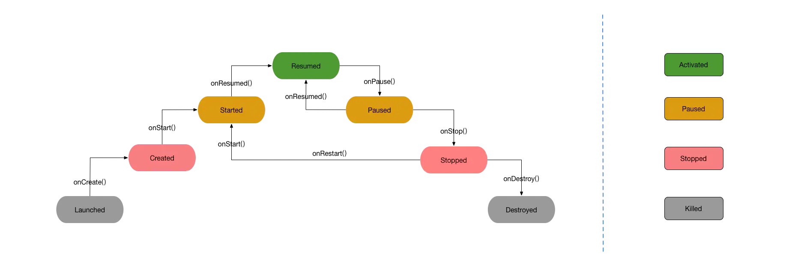
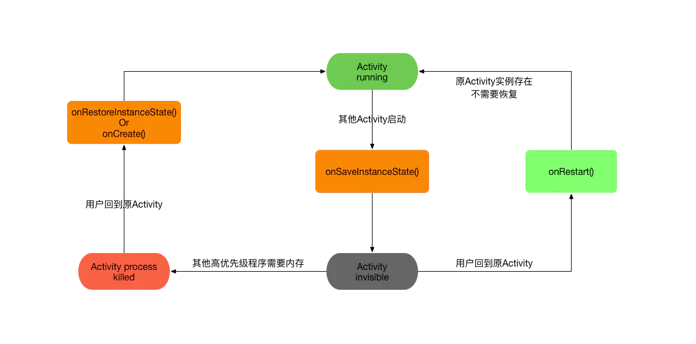

<!--more-->

# Android

[TOC]

## 一、Activity的生命周期 （方法）

### 1. Activity生命周期状态说明

| 方法        | 描述                                                         | 用途（以当前界面播放视频为例）                               | 下一个方法                |
| :---------- | :----------------------------------------------------------- | :----------------------------------------------------------- | :------------------------ |
| onCreate()  | 当Activity第一次创建时调用。该方法（如果有）会提供给你一个包含之前活动的冻结状态信息bundle包。 | 进行一系列初始化操作，如：创建View，加载视频数据等。         | onStart()                 |
| onRestart() | 当Activity被停止后调用，在重新开始之前                       | 当活动停止后重新启动该活动时调用（不常用），针对停止后重启操作。 | onStart()                 |
| onStart()   | 当Activity被展示在用户眼前时调用。如果活动出现在前台紧接着是onResume()，如果活动直接隐藏则紧接着是onStop()。 | 该方法也不常用。                                             | onResume() or onStop()    |
| onResume()  | 当Activity将开始与用户进行交互时调用。在这个时间点你的活动将会在活动堆栈的顶端，用户输入将会访问它。 | 暂停后恢复我们会在该方法中进行一些操作，例如视频继续播放。   | onPause()                 |
| onPause()   | 当系统将要恢复一个之前的活动。这是一个有代表性的常常用于提交未被存储的改动信息为持久数据，停止动画和消耗CPU的东西等。实现该方法必须要特别的迅速，因为在此方法返回之前，下一个活动将不会恢复。如果活动将返回到前台则接下来调用onResume()，如果要隐藏到用户看不见的地方时，则调用onStop(); | 该方法十分重要，用来做信息持久化存储操作以及停止消耗CPU资源操作，如记录视频播放进度时间，以及暂停视频播放操作等。 | onResume or onStop()      |
| onStop()    | 当另一个活动被恢复且完全覆盖该活动，而该Activity将不在展示给用户时调用。这种情况将发生在一个新的活动将被开始，一个退出的活动将被恢复，又或者该活动将要被销毁。如果该活动将恢复与用户交互则调用onRestart(),如果该活动将被销毁则调用onDestory()。 | 界面将会隐藏或销毁，做一些重要信息或未被存储的信息的存储操作。但也不要太耗时。如存储用户信息等操作，以及用户此次观看的视频地址以及时间，便于下次打开该界面时继续播放。 | onRestart() or onResume() |
| onDestory() | Activity被销毁钱最后一个被调用的方法。这个方法将会发生因为活动将会结束（在活动中调用finish()方法，或者系统临时销毁该实例节约空间。你可以使用isFinishing()方法区别这两种场景）。 | 界面将要销毁，释放一些实例节约空间，如置空List集合等。       |                           |

### 2. Activity4种本质状态：

- 运行： 当前显示在屏幕的activity(位于任务栈的顶部)，用户可见状态。 如果当前的activity在前台界面上时（堆栈顶端）。
- 暂停： 依旧在用户可见状态，但是界面焦点已经失去，此Activity无法与用户进行交互。 如果activity被另一个非全屏活动强占焦点并覆盖时（如弹窗dialog），它将会暂停。一个暂停的活动也是完全活跃的（它的所有的状态和成员信息将会保留，但activity本身将不会再依附于WindowsManager了），在内存极度缺乏的状态会被系统杀死。
- 停止： 用户看不到当前界面,也无法与用户进行交互 完全被覆盖.。如果activity完全被另一个全屏活动遮挡住时，它将会停止。该活动也仍保留全部的状态和成员信息，但将会被隐藏起来不再展示给用户，并且当内存在其他地方被需要时该活动就将会被系统杀死。
- 重启： 当前界面被销毁，等待这系统被回收 。如果activity处于暂停或者停止状态，系统将会在内存中终止该活动无论是结束活动或者杀死进程。当它再一次展示给用户时，它必须是完全重启并且恢复到之前的状态。

### 3. activity的状态阶段

### 4. 状态转换 

### 5. 生命周期

- onCreate()：当我们点击activity的时候，系统会调用activity的oncreate()方法，在这个方法中我们会初始化当前布局setContentLayout（）方法。
- onStart()：onCreate()方法完成后，此时activity进入onStart()方法,当前activity是用户可见状态，但没有焦点，与用户不能交互，一般可在当前方法做一些动画的初始化操作。
- onResume()：onStart()方法完成之后，此时activity进入onResume()方法中，当前activity状态属于运行状态 (Running)，可与用户进行交互。
- onPause()：当另外一个activity覆盖当前的acitivty时，此时当前activity会进入到onPause()方法中，当前activity是可见的，但不能与用户交互状态。
- onStop()：onPouse()方法完成之后，此时activity进入onStop()方法，此时activity对用户是不可见的，在系统内存紧张的情况下，有可能会被系统进行回收。所以一般在当前方法可做资源回收。
- onDestory()：onStop()方法完成之后，此时activity进入到onDestory()方法中，结束当前activity
- onRestart()：onRestart()方法在用户按下home()之后，再次进入到当前activity的时候调用。调用顺序onPouse()->onStop()->onRestart()->onStart()->onResume().

### 6. onSaveInstanceState(Bundle outState)

- onSaveInstanceState函数在Activity生命周期中执行。
- outState 参数作用 :数据保存 : Activity 声明周期结束的时候, 需要保存 Activity 状态的时候, 会将要保存的数据使用键值对的形式 保存在 Bundle 对象中;
-  用户主动销毁不会调用 : 当用户点击回退键 或者 调用了 finish() 方法, 不会调用该方法; 
-  调用时机不固定 : 该方法一定是在 onStop() 方法之前调用, 但是不确定是在 onPause() 方法之前 还是 之后调用; 
- 布局中组件状态存储 : 每个组件都 实现了 onSaveInstance() 方法, 在调用函数的时候, 会自动保存组件的状态, 注意, 只有有 id 的组件才会保存;
- 关于默认的 super.onSaveInstanceState(outState) : 该默认的方法是实现 组件状态保存的;
- 调用时机 :
  1. Activity 被销毁的时候调用, 也可能没有销毁就调用了;
  2. 按下Home键 : Activity 进入了后台, 此时会调用该方法;
  3. 按下电源键 : 屏幕关闭, Activity 进入后台;
  4. 启动其它 Activity : Activity 被压入了任务栈的栈底;
  5. 横竖屏切换 : 会销毁当前 Activity 并重新创建；

### 7. onRestoreInstanceState(Bundle outState)

- 方法回调时机 : 在 Activity 被系统销毁之后 恢复 Activity 时被调用, 只有销毁了之后重建的时候才调用, 如果内存充足, 系统没有销毁这个 Activity, 就不需要调用;
- Bundle 对象传递 : 该方法保存的 Bundle 对象在 Activity 恢复的时候也会通过参数传递到 onCreate() 方法中;

### 8. Activity切换

 当AActivity切换BActivity的所执行的方法： 

- AActivity:onCreate()->onStart()->onResume()->onPause()
- BActivity:onCreate()->onStart()->onResume()
- AActivity:onStop()->onDestory()

 当AActivity切换BActivity（此activity是以dialog形式存在的）所执行的方法: 

-  AActivity:onCreate()->onStart()->onResume()->onPause()
- BActivity:onCreate()->onStart()->onResume() 

## 二、Fragment的生命周期和方法

### 1.  碎片与活动

`Fragment`的生命周期与`Activity`的生命周期密切相关。 `Activity`管理`Fragment`生命周期的方式是在`Activity`的生命周期方法中调用`FragmentManager`的对应方法，通过`FragmentManager`将现有的`Fragment`迁移至下一个状态，同时触发相应的生命周期函数。

### 2. Fragment使用注意

- 使用Fragment时，必要构建一个无参构造函数，系统会默认带。但一但写有参构造函数，就必要构建无参构造函数。一般来说我们传参数给Fragment，会通过bundle，而不会用构造方法传 
-  Fragment是直接从Object继承的，而Activity是Context的子类。 
-  Fragment是依赖于Activity的，不能独立存在的。
-  一个Activity里可以有多个Fragment。
-  一个Fragment可以被多个Activity重用。
-  Fragment有自己的生命周期，并能接收输入事件。
-  我们能在Activity运行时动态地添加或删除Fragment。

- [ ] Activity的四种启动模式、在app中的应用场景

- [ ] ## standard

  默认模式:

  - 每次启动时都会创建一个新的实例

  ## singleTop

  栈顶模式:

  - 当启动Activity时,若该Activity位于栈顶,也就是正在前台与用户交互，那就复用这个Activity不会重新创建，该实例Activity.onNewIntent()方法会被调用.
  - 当启动Activity时,若该Activity位于没有位于栈顶则创建和默认模式一样重新创建一个新的实例

  ## singleTask

  栈内唯一模式:

  - 在启动activity时，若没有该Activity的实例存在于栈内,则会重新创建该Activity的实例.
  - 在启动activity时，若该栈内存在于该Activity的实例并且位于栈顶,则不会重新创建,而是复用该实例,并且会调用Activity.onNewIntent()方法.
  - 在启动activity时，若该栈内存在于该Activity的实例并且没有位于栈顶，那么这个Activity实例会被置为栈顶，并且移除其上面的所有Activity,并调用Activity.onNewIntent()方法

  ## singleInstance

  应用内栈唯一模式:
   Activity的实例会存在于单独的任务栈内

  - 在启动activity时，若该实例存在则
     其会被置为栈顶并且调用其 Activity.onNewIntent()方法.
  - 在启动activity时，若该实例不存在,则要启动一个新activity实例,并且会存在于一个单独的任务栈中

- [ ] View在Activity中显示出来的步骤、执行方法名、用途

- [ ] rxjava、rxjava名字

- [ ] mvc具体 数据库存取在那个、网络请求涉及那个

- [ ] 数据库存储在主线程会引发啥

- [ ] ANR  Application Not Responding 是

- [ ] 为啥耗时操作要多线程

- [ ] 界面绘制、居中最简单操作

- [ ] activity和fragmeng的区别和方法

