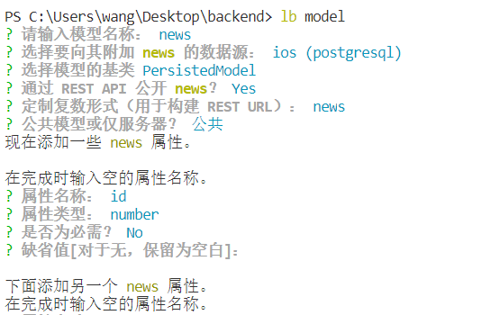
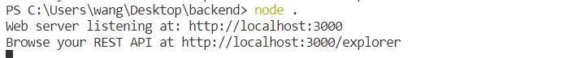
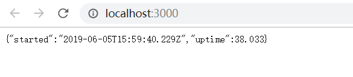
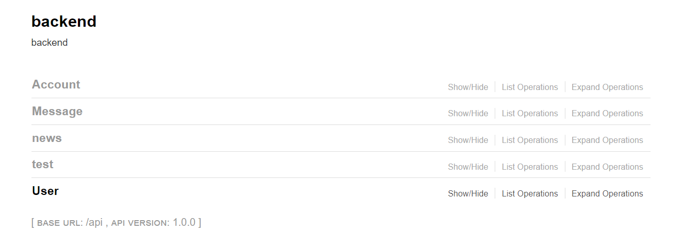
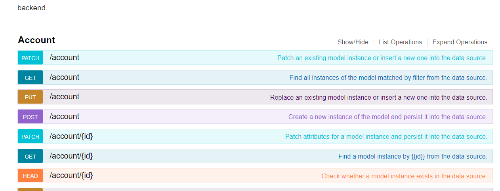
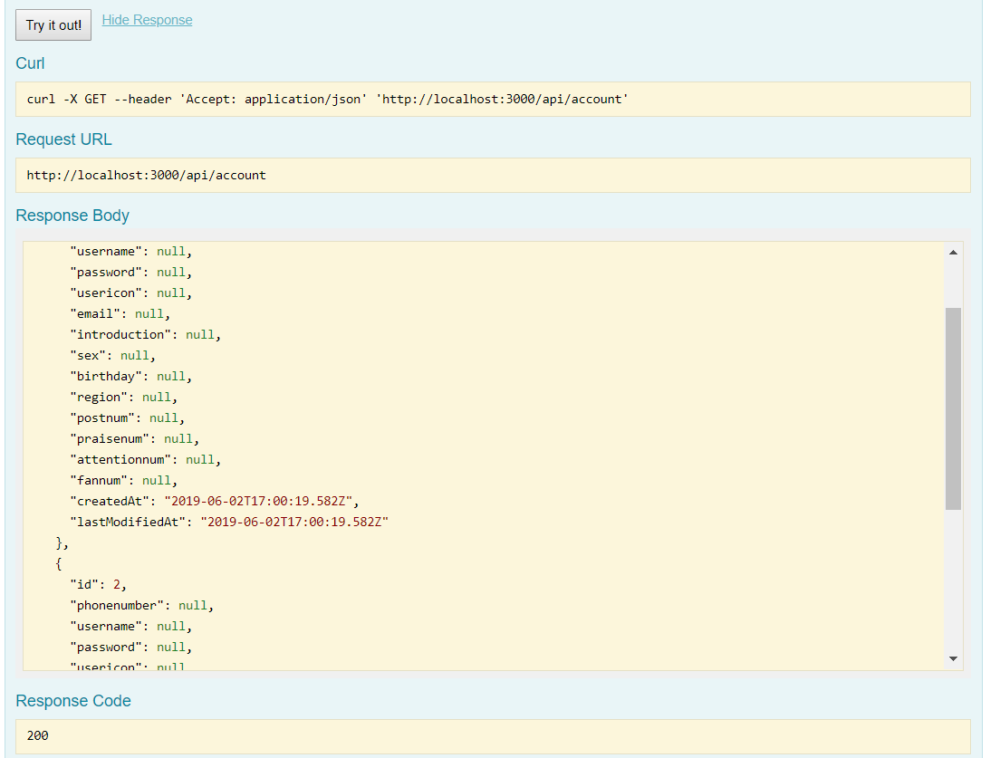
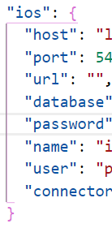
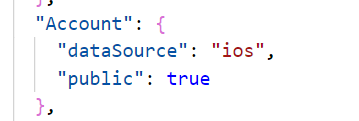

## 使用Loopback创建一个应用
<!--more-->
在一个空文件夹里使用loopback-cli 命令`lb`创建一个新的应用，之后根据提示进行操作，使用`npm install`安装依赖

### 创建一个数据模型

完成初始项目的构建后，进入项目目录，输入命令`lb model`创建一个自动具有REST API接口的模型。



属性可以在模型的json文件中修改，使用数据库进行存储，之前我已经配置好了数据库。

模型是LoopBack的核心，表示如数据库或其他后端服务（REST，SOAP等）等后端数据源。 LoopBack模型是具有Node和REST API的JavaScript对象。

LoopBack的一个关键功能是当您定义一个模型时，它将自动附带预定义的REST API，并具有完整的创建，读取，更新和删除操作。

Basic模型对象具有添加钩子和验证数据的方法。其他模型对象都“继承”它。模型具有继承层次结构，将模型附加到持久性数据源时，它将成为具有创建，检索，更新和删除操作的连接模型。

模型生成器将在应用程序的 `common / models` 目录中创建两个定义模型的文件： `.json` 和 `.js`。

### 运行应用程序

使用`$ node .`可以运行应用程序，

 

打开第一个可以看到初始的信息



 打开第二个可以看到API信息



展开后可以看到具体的模型，以我以及实现的account为例



测试一下`get`



## 将API连接到数据源

使用`$ lb datasource`打开数据源生成器定义数据源

根据提示进行选择，这里选择的是`postgreSQL`



之后在`model-config.json`中将`account`的`dataSoucre`设置为`ios`



可以直接尝试执行一些SQL语句，不过`LoopBack`提供了一个`Node API`，可以自动执行一个称作`auto-migration`的程序，主要用于保存一些测试数据到数据源。

通过`LoopBack`，添加一个远程方法，可以访问任何标准模型创建，检索，更新和删除方法来执行数据处理和验证，例如：

```js
Account.getName = function (id, cb) {
    Account.findById(id, function (err, instance) {
      var response = instance.name;
      cb(null, response);
      console.log(response);
    });
  };
  Account.remoteMethod(
    'getName',
    {
      http: { path: '/getname', verb: 'get' },
      accepts: { arg: 'id', type: 'number', required: true, http: { source: 'query' } },
      returns: { arg: 'name', type: 'string' }
    }
  );
```

### 远程钩子介绍

远程钩子（remote hook）是一个在远程方法（自定义远程方法或内置CRUD方法）之前或之后执行的功能。

- `beforeRemote()`在远程方法之前运行。
- `afterRemote()`在远程方法之后运行。

