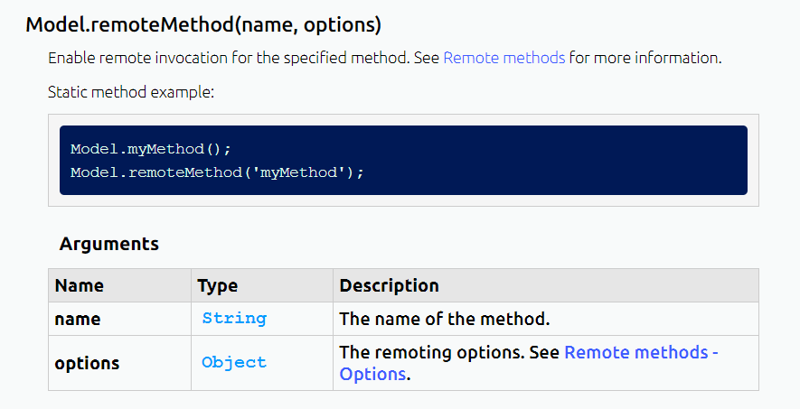
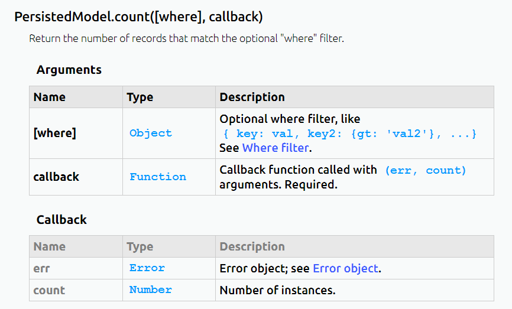
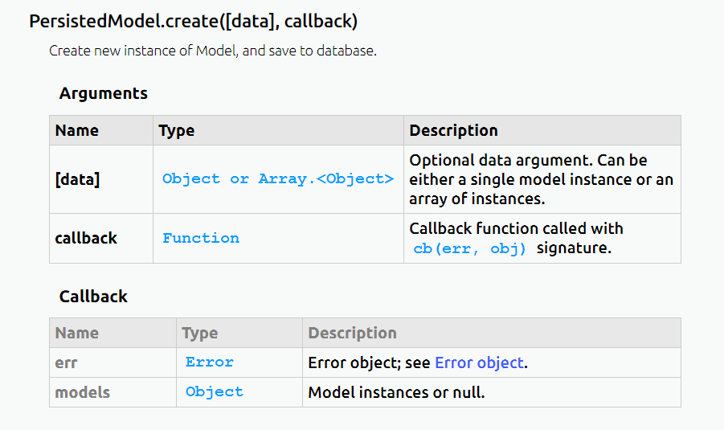
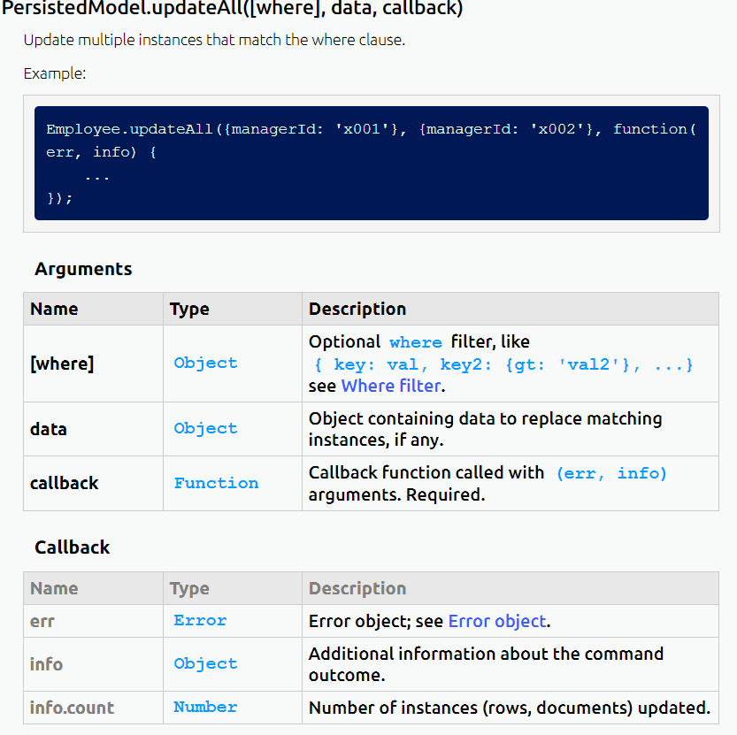
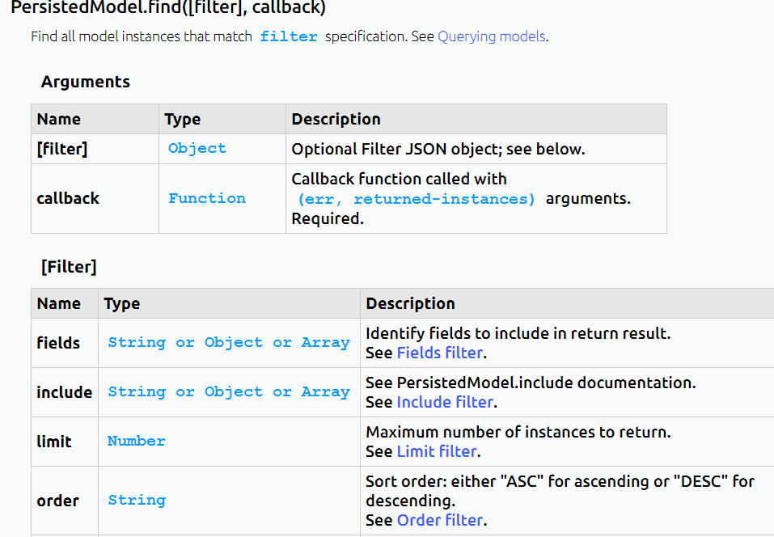
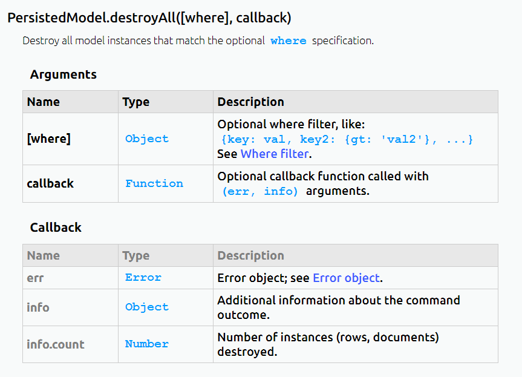

## Loopback远程方法

<!--more-->
Loopback远程方法需要调用`remoteMethod`



样例代码：

```js
Account.remoteMethod(
    'findByName',
    {
      http: { path: '/findByName', verb: 'get' },
      accepts: { arg: 'name', type: 'string', required: true, http: { source: 'query' } },
      returns: { arg: 'user', type: 'object' }
    });
```

同时模型进行相应的操作：

```js
Account.findByName = function (name, cb) {
    Account.find({where: {UserName:name}}, function (err, instance) {
      console.info(instance.id);
      cb(null, instance);  
    });  
  };
```

## 持久化模型

对于持久化模型，Loopback封装了很多增删查改的操作，本次用到的有：

### 计数操作



样例代码：

```js
 Account.count({PhoneNumber:user.PhoneNumber}, function (err, count) {
      console.info(count);});
```

### 创建操作



样例代码：

```js
Account.create(user, function (err, instance) {
          cb(null, 'successful');
        });
```

### 更新操作



样例代码：

```js
Account.updateAll({PhoneNumber:user.PhoneNumber},user, function (err, instance) {
          console.info(instance.id);
          cb(null, 'successful');  
        }); 
```

### 查询操作



样例代码：

```js
Account.find({where: {PhoneNumber:phone}}, function (err, instance) {
      console.info(instance.id);
      cb(null, instance);  
    });
```

### 删除操作



样例代码：

```js
Account.destroyAll({PhoneNumber:phone}, function (err, info) {
      console.info(info.id);
      cb(null, info);  
    });
```

