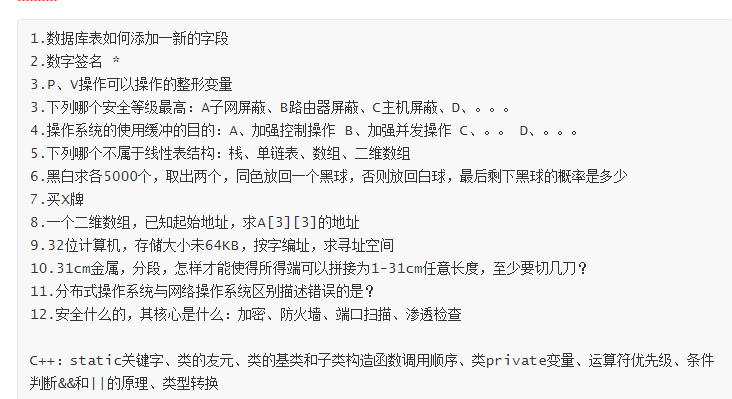

<!--more-->

# JAVA、Android

- [ ] == 和equal  [1](https://www.cnblogs.com/zhuyeshen/p/10954275.html)

- [ ] 面向对象和面向过程

- [ ] C++和java的区别  [1](https://www.sohu.com/a/233598512_100180425)  [2](https://blog.csdn.net/u010120125/article/details/78261480)

- [ ] String 、Stringbuffer 、Stringbuild

- [ ] 重写和重载 举例

- [ ] java三大特性 封装、继承、多态

- [ ] http请求长地址网页

- [ ] tcp udp区别

- [ ] 数据结构的几种

- [ ] 类加载的过程

- [ ] 成员变量和局部变量

- [ ] 进程和线程的区别

- [ ] 线程的状态

- [ ] java线程和线程池

- [ ] java多线程方法

- [ ] 多线程可以在单cpu执行吗

- [ ] 两个800m内存可以在1g内存运行吗

- [ ] 单例模型、饿汉式、懒汉、线程安全

- [ ] web请求过程

- [ ] http协议 post、get区别

- [ ] tcp 、dns 、ip、http处于那个层

- [ ] 选择排序 时间复杂度、最优、最差

- [ ] 平衡二叉树

- [ ] 堆排序

- [ ] 哈希表

- [ ] 数据库表非常大时

- [ ] 链表反转

- [ ] 指针指向int和double有啥区别

- [ ] 快速排序

- [ ] hashmap和hashtable

- [ ] 有那些可以用在快速索引

- [ ] vue渲染过程

- [ ] kmp回文查找

- [ ] ios开发基础、对ios了解多少

- [ ] http请求过程

- [ ] 如何请求服务器不存在

- [ ] mvc怎么实现，各个部分如何联系

- [ ] android数据绑定问题

- [ ] tcp如何实现重传

- [ ] tcp没有收到服务器回应，如何重传

- [ ] tcp拥塞控制、慢开始

- [ ] oc垃圾回收机制、java垃圾回收机制

- [ ] java内存分配

- [ ] http响应头

- [ ] 进程线程区别

- [ ] 进程如何通信

- [ ] P、V如何做到多线程互斥，加锁的底层原理

- [ ] 面对对象和基于事件的区别

- [ ] adapter底层如何实现数据绑定

- [ ]  找两个链表重叠的开始结点（双指针）

- [ ] 面向对象对于面向过程有什么优势 

- [ ] 对多线程的理解（我答提高并发度，安卓ANR需要多线程解决） 

- [ ]  假如只有一个cpu，单核，多线程还有用吗 

- [ ] hashmap和hashtable有啥不同（我说底层实现差不多，但是hashtable是线程安全的，因为访问的时候会加锁） 

- [ ] 怎么做到线程互斥 

- [ ] synchronized描述的一个静态方法和一个普通方法都对一个变量count进行访问，能保证线程安全吗（答不能，对象锁和类锁不是同一个东西） 

- [ ] 对反射有了解吗（答了动态获取对象，在注解上的应用） 

- [ ] activity生命周期

- [ ] databind

- [ ] view绑定和传递

- [ ] OOM

- [ ] 

  
  
  ​    

编程题：

- [ ] 用2个队列实现栈
- [ ] 计算两数和的下标
- [ ] 计算树的节点的最大距离

 

