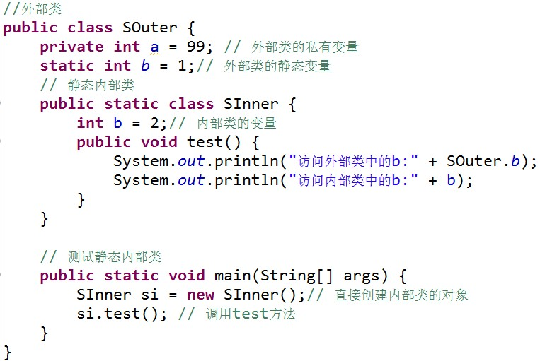
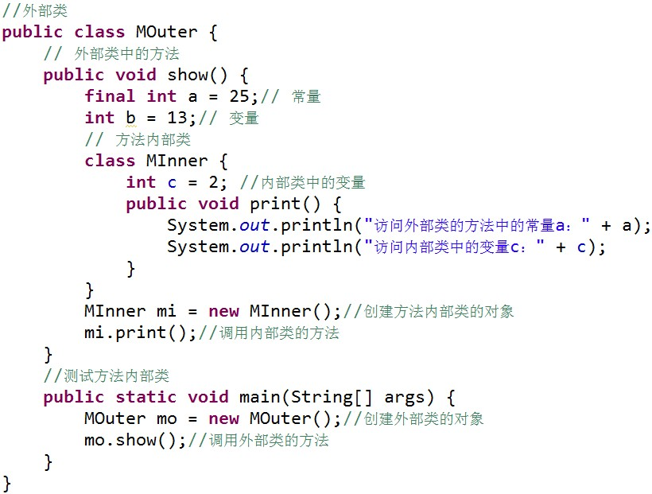
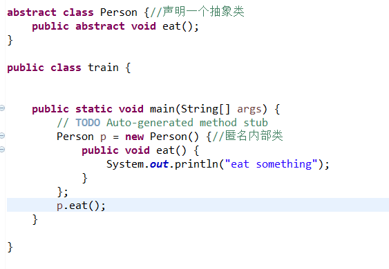
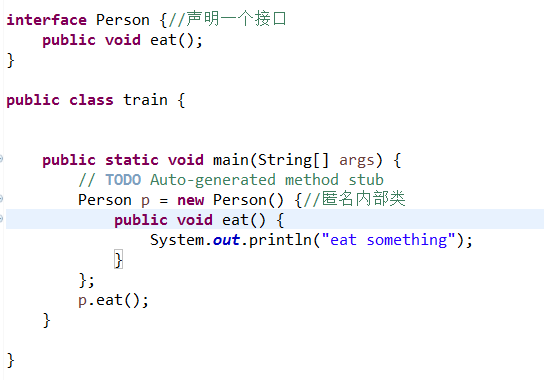

<!--more-->

# Java知识点整理

## 一、基本概念

#### 1. 面对对象和面向过程

- 面向对象就是构成问题事务分解成各个对象，建立对象的目的不是为了完成一个步骤，而是为了描叙某个事物在整个解决问题的步骤中的行为。 易维护、易复用、易扩展，由于面向对象有封装、继承、多态性的特性，可以设计出低耦合的系统，使系统更加灵活、更加易于维护。
- 面向过程分析出解决问题所需要的步骤，然后用函数把这些步骤一步一步实现，使用的时候依次调用。性能比面向对象高，因为类调用时需要实例化，开销比较大，比较消耗资源。 

#### 2. C++和Java区别

-  **Java 没有指针的概念** 。 有效地防止了一系列由指针引起的操作层失误（如指针悬空所造成的系统崩溃），更有利于 Java 程序的安全 。
-  **Java不支持多重继承** 。多重继承即 一个类允许继承多个父类， Java 不支持多重继承，但允许一个类实现多个接口 。
-  **Java 是完全面向对象的语言**，所有方法和数据都必须是**类**的一部分。除了**基本数据类型**之外，其余类型的数据都作为**对象型数据** 。
-  **自动内存管理** 。 **Java 自动进行无用内存回收操作，不再需要程序员进行手动删除。**Java 程序中所有的对象都是用 **new 操作符**建立在堆栈上的。 当 Java 中一个对象不再被用到时，无须使用内存回收器，只需要给它添加删除标签，无用内存的回收器便利用空闲时间在后台运行。
-  **Java 不支持操作符重载** 。
-  **预处理功能**。 Java 允许预处理，但不支持预处理器功能，因为 Java 没有预处理器，所以为了实现预处理，它提供了引入语句（`import`）。
-  **缺省参数函数** 。 **Java 不支持缺省参数函数，而 C++支持** 
- **字符串**。 **C 和 C++不支持字符串变量**，在 C 和 C++程序中使用**`Null`**终止符**代表字符串的结束。在 Java 中字符串是用**类对象**（`String` 和 `StringBuffer`）来实现的，在整个系统中建立字符串和访问字符串元素的方法是一致的 
-  **`goto` 语句**。  Java 不提供 `goto` 语句 
-  **类型转换**。 在 C 和 C++中，有时会出现数据类型的隐含转换，这就涉及了自动强制类型转换问题。 Java 不支持 C++中的自动强制类型转换，如果需要，必须由程序显式进行强制类型转换。 

#### 3. 编译型语言和解释型语言

-  **编译型语言**：把做好的源程序全部编译成二进制代码的可运行程序。然后，可直接运行这个程序。 编译型语言，执行速度快、效率高；依靠编译器、跨平台性差。 包括：`C`、`C++`、`Delphi`、`Pascal`、`Fortran` 。
- **解释型语言**：把做好的源程序翻译一句，然后执行一句，直至结束！解释型语言，执行速度慢、效率低；依靠解释器、跨平台性好 。 包括：`Java`、`Basic`、`javascript`。

#### 4. Java三大特性

- **封装**： 将类的某些信息隐藏在类内部，不允许外部程序直接访问，而是通过该类提供的方法来实现对隐藏信息的操作和访问 

  - **特点**： 只能通过规定的方法访问数据，  隐藏类的实例细节，方便修改和实现 

  - | 访问修饰符 | 本类 | 同包 | 子类 | 其他 |
    | :--------: | :--: | :--: | :--: | :--: |
    |  private   | true |      |      |      |
    |    默认    | true | true |      |      |
    | protected  | true | true | true |      |
    |   public   | true | true | true | true |

  - **this关键字**：代表当前对象，可以区别函数参数名和成员函数 

  -  **内部类（ Inner Class ）**：定义在另外一个类里面的类，包含内部类的类被称为外部类 。内部类的方法可以直接访问外部类的所有数据，包括**私有的数据**。内部类提供了**更好的封装**，可以把内部类**隐藏**在外部类之内，**不允许**同一个包中的其他类访问该类 。 使用内部类可以非常方便的编写事件驱动程序。 

    -  **成员内部类**  ：

        

      1.  必须使用外部类对象来创建内部类对象,即：**内部类 对象名 = 外部类对象.new 内部类( );**  
      2. 外部类是**不能直接使用**内部类的成员和方法;  如果外部类和内部类具有**相同的成员变量或方法**，内部类**默认访问自己的成员变量或方法**，如果要访问外部类的成员变量，可以使用 **外部类类名.this 关键字**。

    -  **静态内部类** ： 

        

      1. 静态内部类**不能直接访问**外部类的**非静态成员**，但可以通过 **new 外部类().成员** 的方式访问
      2. 创建静态内部类的对象时，不需要外部类的对象，可以**直接**创建 **内部类 对象名= new 内部类()
      3. 如果外部类的静态成员与内部类的成员**名称相同**，可通过“**类名.静态成员**”访问外部类的静态成员；如果外部类的静态成员与内部类的成员名称**不相同**，则可通过“**成员名”**直接调用外部类的静态成员。 

    -  **方法内部类**  ：　方法内部类就是内部类定义在外部类的**方法中**，方法内部类只在该方法的内部可见，即**只在该方法内可以使用**。  方法内部类**不能使用访问控制符和 static 修饰符** 

       

      

    -  **匿名内部类**　　 

       

         

      1.  匿名类是**不能有名称的类**，无法引用。必须在创建时，作为**new语句**的一部分来声明他们。 
      2.  使用匿名内部类时，我们必须是继承一个类或者实现一个接口，但是两者不可兼得，同时也只能继承一个类或者实现一个接口 
      3.  匿名内部类中是不能定义构造函数的。 
      4.  匿名内部类中不能存在任何的静态成员变量和静态方法 
      5.  匿名内部类为局部内部类（即方法内部类），所以局部内部类的所有限制同样对匿名内部类生效。 
      6.  匿名内部类不能是抽象的，它必须要实现继承的类或者实现的接口的所有抽象方法。 
      7.  当所在的方法的形参需要被内部类里面使用时，该形参必须为final ，保证形参不改变

      

- **继承**：

- **多态**：

#### 5. 引用拷贝、浅拷贝、深拷贝

#### 6. 单处理器可以多线程吗

